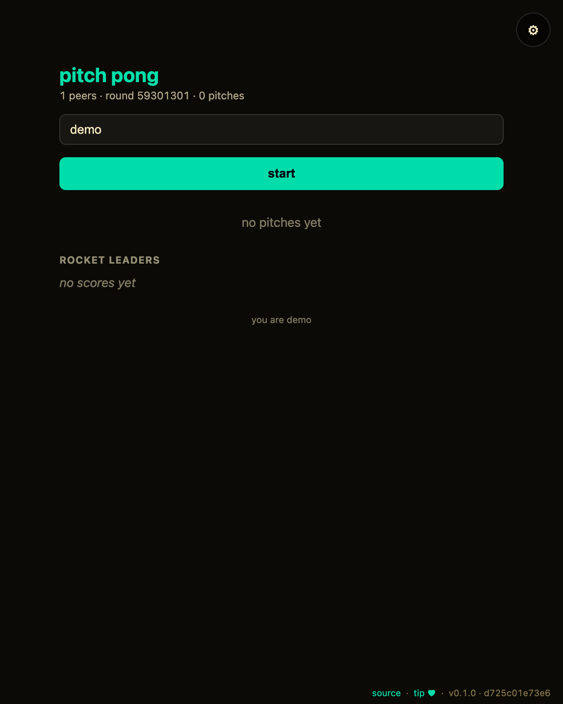

# mesh-pitch-pong

[](https://baditaflorin.github.io/mesh-pitch-pong/)
[](https://github.com/baditaflorin/mesh-pitch-pong/blob/main/package.json)
[](./LICENSE)

> Round-robin pitch jam: each peer gets a 30s turn on the mic to drop a one-line idea, the room reacts 🚀 / 🤔 / 👎, and rockets rank the leaderboard.

**Live → https://baditaflorin.github.io/mesh-pitch-pong/**

**Source → https://github.com/baditaflorin/mesh-pitch-pong**

**Tip the dev (buy a coffee) → https://www.paypal.com/paypalme/florinbadita**

---



> Two peers, side-by-side, in the same room. Drop a `tests/demo/scenario.mjs`
> exporting `default async (a, b) => …` and run `npm run demo` to regenerate
> `docs/preview.png` plus `docs/demo-a.webm` / `docs/demo-b.webm` clips.


## What it is

A **rootless-computing** peer-to-peer browser app. No backend of its own beyond the self-hosted WebRTC stack listed below. State lives in a Yjs mesh shared by everyone in the same room.

Read the principles → **https://baditaflorin.github.io/rootless-computing/principles.html**

## Try it in 30 seconds

1. Open the live URL in **two browser tabs** (both default to the same room).
2. Type a name in each tab, then hit **start** in one.
3. One tab is "on the mic" — type a one-line pitch there and **drop** it.
4. The other tab sees the pitch instantly; tap 🚀 / 🤔 / 👎 — the rocket count syncs back and climbs the leaderboard.
5. Wait for the 30s timer and the mic rotates to the next peer.

## Quickstart

Open the live URL on two devices in the same room (set in ⚙ settings, or scan the room QR). Everything else is in-app.

For local hacking:

```bash
git clone https://github.com/baditaflorin/mesh-common
git clone https://github.com/baditaflorin/mesh-pitch-pong
cd mesh-pitch-pong
npm install
npm run dev
```

`mesh-common` must sit as a **sibling** directory because `package.json` references it via `file:../mesh-common`.

## Self-hosted infrastructure

| Repo                                              | Endpoint                               | Purpose                     |
| ------------------------------------------------- | -------------------------------------- | --------------------------- |
| https://github.com/baditaflorin/signaling-server  | `wss://turn.0docker.com/ws`            | y-webrtc signaling fan-out  |
| https://github.com/baditaflorin/turn-token-server | `https://turn.0docker.com/credentials` | HMAC TURN creds, 1-hour TTL |
| https://github.com/baditaflorin/coturn-hetzner    | `turn:turn.0docker.com:3479`           | TURN relay                  |

## Settings overrides

The settings drawer lets the user override signaling and TURN endpoints. localStorage keys:

- `mesh-pitch-pong:signalingUrl`
- `mesh-pitch-pong:turnTokenUrl`
- `mesh-pitch-pong:iceServers`
- `mesh-pitch-pong:room`

If endpoints are blank or unreachable, the app falls back to STUN-only.

## Version + commit on every screen

The bottom-right footer on every screen of the live app shows:

- `source` → this repo
- `tip ♥` → PayPal
- `vX.Y.Z · <short-sha>` — version from `package.json` plus the build-time git commit

## Build & deploy

GitHub Pages serves the committed `docs/` directory on the `main` branch. There is no GitHub Actions build workflow; local Husky-style hooks gate formatting / typecheck / smoke build before each push.

```bash
npm run smoke                                    # build + sanity-check docs/
bash ../mesh-common/scripts/screenshot-app.sh    # regenerate docs/screenshot.png
```

## Privacy

See `docs/privacy.md` for the threat model — what other peers in the mesh see, what the self-hosted infra sees, what stays local.

## License

MIT — see `LICENSE`.
